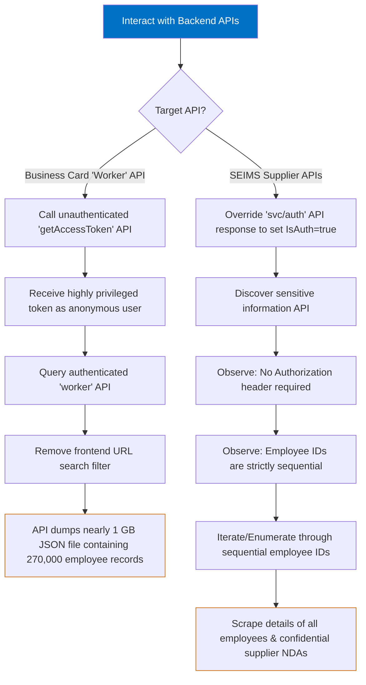
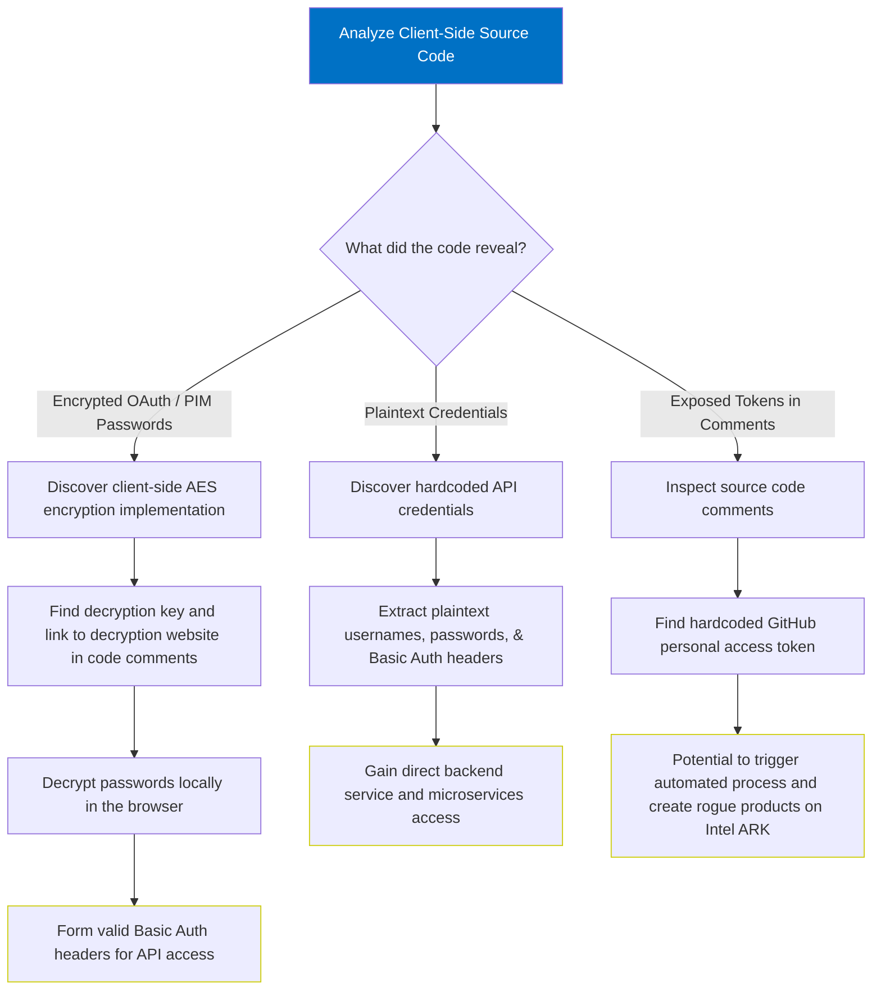
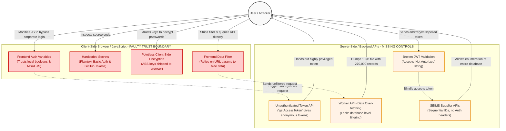
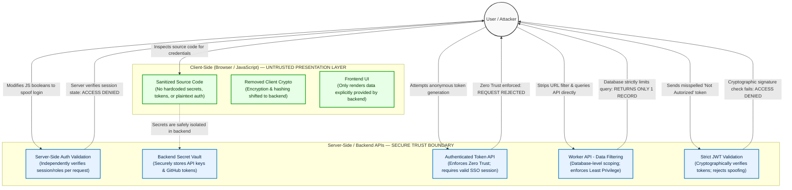

# Intel Employee Data Breach 2025

# Abstract

In late 2024, security researcher Eaton Zveare discovered a series of critical vulnerabilities across multiple internal Intel web applications, an incident he dubbed the "Intel Outside" project. By exploiting these flaws, he was able to easily bypass corporate authentication and exfiltrate the personal details including names, roles, phone numbers, managers, and email addresses of more than 270,000 Intel employees worldwide. Beyond employee data, the vulnerabilities also exposed highly sensitive corporate documentation, including unreleased product details and confidential non-disclosure agreements (NDAs) signed by Intel's suppliers. Despite the severity of the exposure and the researcher's responsible disclosure, he was not awarded a bug bounty, as Intel's reward program at the time explicitly excluded web infrastructure.

The breaches targeted four primary internal systems: an Intel India business card ordering site, a "Hierarchy Management" platform, a "Product Onboarding" portal, and the Supplier EHS IP Management System (SEIMS). The root cause of these exposures was a systemic failure to apply fundamental secure coding principles to internal-facing tools. Developers built these systems relying on the "wishful thinking" that external attackers would never find or target internal websites. As a result, the applications were riddled with severe flaws, including misplaced client-side trust that allowed trivial frontend authentication bypasses, insecure APIs lacking access controls that dumped massive amounts of unfiltered data, and the widespread use of hardcoded admin credentials and pointless client-side encryption. This case serves as a stark reminder that internal applications require the exact same security rigor and review processes as public-facing software.

# Analysis

The Intel Data Breach vulnerabilities demonstrate a systemic failure to apply defense-in-depth strategies across internal applications. Developers heavily relied on the flawed assumption that internal tools, hidden behind corporate single sign-on (SSO), did not require rigorous backend security checks. This led to three major categories of easily exploitable vulnerabilities.

## **Client-Side Trust & Authentication Bypasses**

```mermaid
graph TD
    Start[Access Internal Intel Web Application] --> AppType{Target Application?}

    %% Business Card Site Flow
    AppType -->|India Business Card App| MSAL[Intercept MSAL JavaScript Source Code]
    MSAL --> ModifyMSAL[Modify 'getAllAccounts' function to return non-empty array]
    ModifyMSAL --> Bypassed1[App assumes valid user; Bypasses Azure Login]

    %% Hierarchy & Onboarding Flow
    AppType -->|Hierarchy Management / Product Onboarding| AuthBool[Intercept Startup ReactJS Code]
    AuthBool --> ModifyBool[Override 'isAuthenticated' boolean to true]
    ModifyBool --> SkipSSO[Successfully skip SSO Redirect]
    SkipSSO --> GraphAPI[Site queries Microsoft Graph API for user roles]
    GraphAPI --> CommentOut[Comment out API call to make it a no-op]
    CommentOut --> HardcodeRoles[Hardcode local role array e.g., 'admin']
    HardcodeRoles --> Bypassed2[Gain Full Administrative Access]

    %% SEIMS Flow
    AppType -->|SEIMS Supplier Site| JWTFail[Site attempts to fetch JWT and fails]
    JWTFail --> ErrorString[API returns misspelled 'Not Autorized' error]
    ErrorString --> SkipCheck[Modify Angular frontend to skip string check]
    SkipCheck --> Bypassed3[Bypass Initial Login Screen]
    
    style Start fill:#0071c5,color:#fff
    style Bypassed1 fill:#22262B,stroke:#cc0000
    style Bypassed2 fill:#22262B,stroke:#cc0000
    style Bypassed3 fill:#22262B,stroke:#cc0000
```

Across multiple applications built on Angular and ReactJS, Intel developers incorrectly trusted the frontend code to enforce authentication and authorization states. This allowed the researcher to bypass corporate login screens simply by manipulating JavaScript in the browser.

1. **MSAL Manipulation**
    
    On the India business card ordering site, the frontend utilized the Microsoft Authentication Library (MSAL) for JavaScript. The researcher bypassed the Azure corporate login by modifying the `getAllAccounts` function to return a non-empty array, tricking the application into believing a valid user was already logged in.
    
2. **Boolean Overrides & Role Spoofing**
    
    On both the "Hierarchy Management" and "Product Onboarding" sites, the SSO redirect was skipped by locally overriding the `isAuthenticated` boolean variable to `true` at startup. Furthermore, the applications relied on the Microsoft Graph API to determine user permissions. By commenting out this API call to make it a "no-op" and manually hardcoding a local array with specific roles (like "admin" or "SPARK Product Management System Admin"), the researcher instantly granted himself full administrative access.
    
3. **Ignored JWT Validation**
    
    The SEIMS supplier portal featured a remarkably flawed JSON Web Token (JWT) implementation. When an unauthenticated user loaded the site, the API naturally failed to provide a valid JWT, returning a misspelled "Not Autorized" error. The researcher simply modified the Angular frontend code to ignore this specific error string. Incredibly, the backend server completely lacked server-side validation; it blindly accepted the literal string "Not Autorized" as a valid Bearer token and granted access to the system.
    

## I**nsecure APIs & Broken Access Control**

Once past the superficial login screens, the applications relied on backend APIs that failed to enforce the principle of least privilege, allowing for massive data exfiltration.

1. **Unauthenticated Token Generation & Data Over-fetching**
    
    The business card site featured an unauthenticated `getAccessToken` API, allowing an anonymous user to request a highly privileged token. This token was then used to query a "worker" API that suffered from severe data over-fetching. Instead of returning just the data needed for a single business card, the API relied on a frontend URL filter to limit the results. When the researcher removed this filter and queried the API directly using curl, it dumped a nearly 1 GB JSON file containing the personal details of all 270,000 global Intel employees.
    
2. **Insecure Direct Object Reference (IDOR) & Enumeration**
    
    The SEIMS platform was vulnerable to trivial enumeration attacks. Because Intel utilized sequential employee IDs, and the target APIs did not require an Authorization header, an attacker could write a simple script to iterate through the sequential numbers and scrape the sensitive details of the entire database.
    

## **Hardcoded Secrets & Pointless Client-Side Encryption**

In what was likely an attempt to speed up development, the source code of these internal sites was riddled with sensitive credentials, proving that security reviews were either bypassed or severely lacking.

1. **Plaintext Credentials & GitHub Tokens**
    
    The "Hierarchy Management" and "Product Onboarding" sites contained hardcoded administrative credentials, plaintext API usernames and passwords, and Basic auth headers directly in the client-side JavaScript. The most critical leak was a hardcoded GitHub personal access token placed in the code comments, which could have been exploited to trigger an automated process to create rogue, unreleased products on Intel's public ARK database.
    
2. **"100% Pointless" Client-Side Encryption**
    
    Developers attempted to obscure passwords for an OAuth flow and the "PIM" API by using AES encryption. However, because the encryption was performed client-side, the decryption key was inherently shipped to the user's browser. Adding insult to injury, the developers left a comment in the source code linking directly to a third-party website that could be used to decrypt the key. As the researcher noted, implementing AES encryption in client-side code provides zero security.
    

# Mitigation

To prevent vulnerabilities like those found in the "Intel Outside" case, developers and organizations must apply rigorous defense-in-depth strategies. Internal applications must be treated with the exact same level of scrutiny as external, public-facing applications.

### **Never Trust the Client**

The most glaring flaw across these applications was the reliance on client-side logic to enforce authentication and authorization. The researcher bypassed corporate logins simply by modifying local JavaScript variables, such as setting an authentication boolean to true, or bypassing a string check for a misspelled "Not Autorized" error. Authentication and authorization must be strictly enforced on the server side. The backend must independently validate the user's session and role for every request, rather than trusting the frontend's state or easily manipulated JavaScript functions.

### **Implement Proper API Security and Access Controls**

Several of the internal APIs completely lacked proper access controls. For example, an unauthenticated API allowed an anonymous user to request a highly privileged token, and the SEIMS platform allowed sequential employee IDs to be scraped without even requiring an Authorization header. Every API endpoint must enforce authentication, adhering to a Zero Trust model. Furthermore, servers must strictly validate JSON Web Tokens or session cookies before returning any sensitive data.

### **Enforce the Principle of Least Privilege**

APIs should be specifically scoped to return only the data necessary for the user's current view or action. When the researcher removed a simple URL filter on an internal API, the system returned a massive, nearly 1 GB JSON file containing the details of 270,000 global employees. Data filtering must occur at the backend database level to prevent this data over-fetching. Developers should never send bulk databases to the client and rely on the frontend user interface to hide sensitive records.

### **Secure Secret Management**

The source code of internal sites like the Hierarchy Management and Product Onboarding portals contained plaintext usernames, passwords, Basic authentication headers, and even a GitHub personal access token. Developers must never hardcode credentials, API keys, or tokens in frontend code or client-side repositories. Instead, organizations must utilize secure environment variables and backend secret management vaults to keep sensitive keys out of the browser.

### **Understand Cryptography Fundamentals**

In a flawed attempt to secure OAuth and API passwords, developers used AES encryption but performed the encryption client-side, inherently shipping the decryption key directly to the user's browser. In one instance, a code comment even linked to a website that could decrypt the key. As the researcher noted, using AES encryption in client-side code provides zero security. Cryptographic operations protecting sensitive credentials must be executed server-side, and passwords should be properly hashed rather than reversibly encrypted.

### **Mandatory Security Reviews for Internal Tools**

The widespread use of hardcoded tokens suggests developers took shortcuts to make internal development easier, relying on the wishful thinking that nobody outside the company would find these sites. Organizations must mandate comprehensive security reviews for all internal systems, recognizing that hidden URLs do not provide any actual security. Additionally, expanding bug bounty programs to cover web infrastructure can help catch these severe vulnerabilities before malicious actors exploit them.

# Flow Diagram

## Before

## After

# Conclusion

The "Intel Outside" project by EatonWorks serves as a textbook example of the severe dangers associated with neglecting internal application security. By operating under the "wishful thinking" that internal corporate portals were safely hidden behind Single Sign-On walls and isolated from external threats, developers bypassed fundamental secure coding practices. This false sense of security across the business card, Hierarchy Management, Product Onboarding, and SEIMS websites ultimately allowed a single researcher to exfiltrate the personal data of over 270,000 global employees, as well as highly confidential supplier information and unreleased product details.

At the core of this massive exposure was a complete breakdown of the trust boundary. Developers incorrectly placed critical security responsibilities on the client side, utilizing easily manipulated JavaScript variables to enforce authentication, implementing pointless client-side AES encryption, and leaving highly privileged credentials hardcoded directly within the source code. Because the backend APIs lacked basic access controls and suffered from massive data over-fetching, these frontend manipulations easily triggered unrestricted data dumps.

Ultimately, this case proves to developers and organizations that internal tools demand the exact same rigorous security reviews and Zero Trust architecture as any public-facing software. Hidden URLs and corporate login screens do not provide genuine security if the underlying application code is fundamentally flawed. As the researcher noted, internal websites can always be found, and leaving them unsecured can lead to dire consequences. To prevent similar breaches, companies must mandate strict secure coding practices ensuring all authentication and data filtering happens on the backend and expand bug bounty programs to actively incentivize the discovery of vulnerabilities across all web infrastructure.

# References

[Intel Outside: Hacking every Intel employee and various internal websites](https://eaton-works.com/2025/08/18/intel-outside-hack/)

[Intel Employee Data Exposed by Vulnerabilities](https://www.securityweek.com/intel-employee-data-exposed-by-vulnerabilities/)

[Intel ghosts researcher who found web app vulns](https://www.theregister.com/2025/08/20/intel_website_flaws/)

[Researcher downloaded the data of all 270,000 Intel employees from an internal business card website — massive data breach dubbed 'Intel Outside' didn't qualify for bug bounty](https://www.tomshardware.com/tech-industry/cyber-security/researcher-downloaded-the-data-of-all-270-000-intel-employees-from-an-internal-business-card-website-massive-data-breach-dubbed-intel-outside-didnt-qualify-for-bug-bounty)