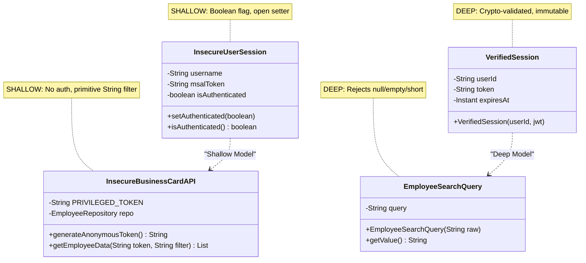

# Project Architecture — Intel Backend

## 1. Overview

Proyek ini adalah backend Java Spring Boot yang merekonstruksi kerentanan keamanan dari insiden "Intel Outside". Arsitektur didesain dengan dua model paralel:

- **Shallow Model:** Implementasi yang sengaja rentan, menunjukkan root cause desain dari breach asli
- **Deep Model:** Implementasi yang aman menggunakan prinsip Domain-Driven Design (DDD) — *Invalid State Unrepresentable*

## 2. Technology Stack

```
┌─────────────────────────────────────────────────┐
│                Spring Boot 4.0.3                 │
│                   Java 17                        │
├─────────────────────────────────────────────────┤
│  Spring Web MVC     │  Spring Security           │
│  (REST Controllers) │  (Auth & Access Control)   │
├─────────────────────────────────────────────────┤
│  Spring Data JPA    │  OAuth2 Resource Server     │
│  (Repository)       │  (JWT validation - Deep)    │
├─────────────────────────────────────────────────┤
│           H2 In-Memory Database                  │
│           (jdbc:h2:mem:inteldb)                  │
├─────────────────────────────────────────────────┤
│  Lombok (boilerplate reduction)                  │
│  Maven (build tool via mvnw)                     │
└─────────────────────────────────────────────────┘
```

## 3. Package Structure (Saat Ini + Rencana)

```
src/main/java/org/example/securecoding/intelbackend/
│
├── IntelBackendApplication.java              # Main entry point
│
├── config/
│   └── SecurityConfig.java                   # Spring Security (permit all untuk shallow)
│
├── model/
│   ├── Employee.java                         # [Kasus A] JPA Entity
│   ├── Product.java                          # [Kasus B] Hierarki produk (self-ref @ManyToOne)
│   ├── AdminCredential.java                  # [Kasus B] Plaintext credentials
│   ├── Supplier.java                         # [Kasus C] Sequential IDs
│   └── SupplierNda.java                      # [Kasus C] NDA + klasifikasi
│
├── repository/
│   ├── EmployeeRepository.java               # [Kasus A]
│   ├── ProductRepository.java                # [Kasus B]
│   ├── AdminCredentialRepository.java        # [Kasus B]
│   ├── SupplierRepository.java               # [Kasus C]
│   └── SupplierNdaRepository.java            # [Kasus C]
│
├── shallow/                                  # ★ VULNERABLE CODE (ALL IMPLEMENTED)
│   ├── InsecureUserSession.java              # [Kasus A] Boolean auth flag
│   ├── InsecureBusinessCardAPI.java          # [Kasus A] Anon token + data over-fetching
│   ├── ShallowController.java               # [Kasus A] REST: /api/shallow/*
│   ├── InsecureProductSession.java           # [Kasus B] Boolean + String[] roles
│   ├── InsecureProductHierarchyAPI.java      # [Kasus B] Plaintext auth + cred exposure
│   ├── ProductHierarchyShallowController.java# [Kasus B] REST: /api/shallow/product/*
│   ├── InsecureSeimsSession.java             # [Kasus C] Broken JWT validation
│   ├── InsecureSeimsAPI.java                 # [Kasus C] Sequential IDs + NDA exposure
│   └── SeimsShallowController.java          # [Kasus C] REST: /api/shallow/seims/*
│
└── deep/                                     # ★ SECURE CODE (ALL PLANNED)
    ├── domain/
    │   ├── VerifiedSession.java             # [Kasus A] Crypto-validated session
    │   ├── EmployeeSearchQuery.java         # [Kasus A] Non-empty search invariant
    │   ├── Role.java                        # [Kasus B] Enum: USER, ADMIN
    │   ├── VerifiedAuthSession.java         # [Kasus B] Immutable, token-validated
    │   ├── SecureSession.java               # [Kasus C] UserId+Token+IP binding
    │   └── IpAddress.java                   # [Kasus C] IP validation domain primitive
    ├── SecureBusinessCardAPI.java           # [Kasus A] Scoped queries
    ├── BusinessCardDeepController.java      # [Kasus A] REST: /api/deep/businesscard/*
    ├── SecureProductHierarchyAPI.java       # [Kasus B] Server-validated auth
    ├── ProductHierarchyDeepController.java  # [Kasus B] REST: /api/deep/product/*
    ├── SecureSeimsAPI.java                  # [Kasus C] Bound sessions
    └── SeimsDeepController.java             # [Kasus C] REST: /api/deep/seims/*
```

## 4. Database Layer

```
src/main/resources/
├── schema.sql       # 6 tables: EMPLOYEE, PRODUCT, ADMIN_CREDENTIAL, SUPPLIER, SUPPLIER_NDA, USER_SESSION
├── data.sql         # 151 employees + 12 products + 2 admin creds + 10 suppliers + 6 NDAs + 2 sessions
└── application.properties
```

- **DDL Strategy:** `ddl-auto=none` — schema dibuat manual via `schema.sql`
- **Seeding:** Data otomatis di-insert via `data.sql` setiap startup
- **Tables:** 6 tables across 3 cases (A: Employee, B: Product + AdminCredential, C: Supplier + SupplierNda + UserSession)
- **Console:** H2 Console tersedia di `http://localhost:8080/h2-console`

## 5. API Routing Architecture

```
/api/
├── shallow/                          # VULNERABLE — Kasus A (✅ implemented)
│   ├── token              GET        # Anonymous token generation
│   └── employees          GET        # Data over-fetching
│
├── shallow/product/                  # VULNERABLE — Kasus B (✅ implemented)
│   ├── login              POST       # Plaintext password authentication
│   ├── hierarchy          GET        # Boolean-only auth check
│   └── credentials        GET        # Exposes hardcoded admin creds
│
├── shallow/seims/                    # VULNERABLE — Kasus C (✅ implemented)
│   ├── auth               POST       # Accepts any Bearer token (broken JWT)
│   ├── suppliers           GET        # Dumps all suppliers
│   ├── suppliers/{id}      GET        # Sequential ID enumeration (IDOR)
│   └── nda/{supplierId}    GET        # Exposes confidential NDAs
│
├── deep/businesscard/                # SECURE (planned - Kasus A)
│   ├── login              POST       # VerifiedSession
│   └── employees          GET        # EmployeeSearchQuery scoped
│
├── deep/product/                     # SECURE (planned - Kasus B)
│   ├── login              POST       # VerifiedAuthSession
│   └── hierarchy          GET        # Role enum access control
│
└── deep/seims/                       # SECURE (planned - Kasus C)
    ├── session            POST       # SecureSession (bound)
    └── suppliers          GET        # Authenticated + rate-limited
```

## 6. Security Configuration

**Saat ini (Shallow Model):** Semua endpoint di-permit tanpa autentikasi.

**Target (dengan Deep Model):**
```java
http.authorizeHttpRequests(auth -> auth
    // Shallow endpoints tetap permit all (untuk demo kerentanan)
    .requestMatchers("/api/shallow/**").permitAll()
    // Deep endpoints wajib authenticated
    .requestMatchers("/api/deep/**").authenticated()
    // H2 Console
    .requestMatchers("/h2-console/**").permitAll()
);
```

## 7. Class Diagram — Shallow vs Deep (Kasus A)


