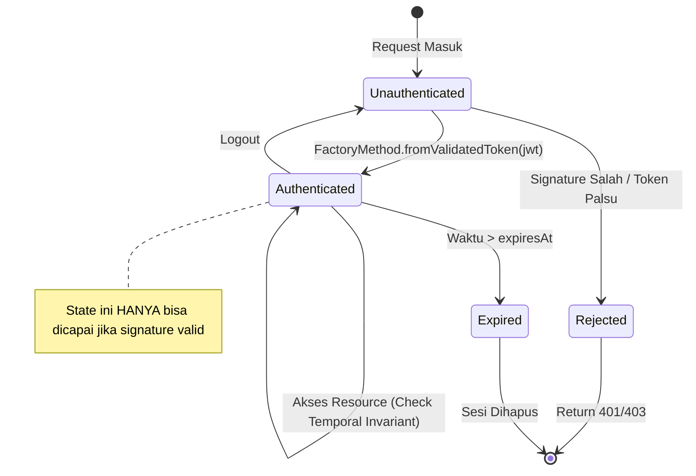

Analisis Root Cause dan Penerapan Secure by Design pada Kasus Kebocoran Data Karyawan Intel Tahun 2025

# Latar Belakang Kasus
Insiden keamanan siber yang mendapat julukan "Intel Outside" yang diteliti oleh Eaton Zveare telah menjadi bukti nyata betapa rentannya aplikasi internal sebuah perusahaan besar terhadap ancaman dari luar [1]. Dalam kejadian yang sangat masif ini, seorang peneliti keamanan berhasil membobol masuk ke berbagai situs web internal milik Intel tanpa menggunakan teknik peretasan yang terlalu rumit. Akibat dari celah keamanan tersebut, data sensitif milik sekitar 270.000 karyawan Intel di seluruh dunia berhasil diunduh secara bebas melalui portal web sistem kartu nama [1], [2].
Selain portal kartu nama, penetrasi keamanan ini juga berhasil mengeksploitasi kelemahan pada Sistem Product Hierarchy dan Sistem SEIMS (Supplier EHS IP Management System). Sistem Product Hierarchy terbukti rentan karena menyimpan kredensial administrator secara langsung di dalam kode program dan memiliki metode validasi peran yang sangat mudah dipalsukan. Sementara itu, Sistem SEIMS berhasil ditembus melalui manipulasi dan dekripsi token otentikasi karena ketiadaan aturan pengikatan sesi yang kuat dengan identitas asli pengguna. Serangkaian peretasan pada ketiga sistem ini menunjukkan bahwa perlindungan jaringan yang berlapis di luar akan percuma jika desain aplikasi internal di dalamnya memiliki kecacatan struktural.
Berbagai celah keamanan yang ditemukan pada ketiga aplikasi internal tersebut pada dasarnya bermuara pada kegagalan pemodelan sistem dalam menjaga status operasional yang aman secara mutlak. Oleh karena itu, proses rekonstruksi akar permasalahan pada Sistem Kartu Nama, Product Hierarchy, dan SEIMS menjadi langkah krusial untuk memahami secara pasti letak kegagalan desain awal tersebut. Melalui analisis rekonstruksi yang mendalam ini, kita dapat merancang solusi perbaikan desain yang kokoh dengan menerapkan aturan ketat pada struktur kode program sehingga segala bentuk keadaan sistem yang berbahaya menjadi mustahil untuk diciptakan.

# Analisis Kasus
Penetrasi sistem pada kasus ini terjadi di beberapa platform internal yang memiliki karakteristik kerentanan yang sangat berbeda. Pada platform Sistem Kartu Nama, aplikasi gagal menerapkan batasan agregat yang tepat sehingga satu pengguna biasa bisa menarik seluruh data karyawan secara bebas. Sementara itu, Sistem Product Hierarchy memiliki kelemahan fatal di mana kredensial administrator sengaja ditanamkan langsung di dalam kode sumber program.
Selain kedua sistem tersebut, aplikasi SEIMS juga menunjukkan tingkat kerentanan yang tinggi pada bagian manajemen sesinya. Sistem ini membiarkan sesi otentikasi berjalan tanpa adanya pengikatan yang kuat antara identitas asli pengguna dan token yang diterbitkan. Ketiga sistem ini menunjukkan dengan jelas bahwa kerentanan bersumber dari kegagalan pemodelan sistem dalam mempertahankan status yang aman secara struktural.
Akar permasalahan dari berbagai kerentanan tersebut dapat dijelaskan melalui kegagalan desain struktural dalam mencegah keadaan yang berbahaya. Pada Sistem Kartu Nama, ketiadaan aturan otorisasi berbasis kepemilikan merupakan bentuk kelemahan referensi objek langsung yang dapat dieksploitasi secara maksimal oleh penyerang. Pada Sistem Product Hierarchy, celah keamanan bermula dari kebiasaan pemodelan dangkal dan obsesi terhadap tipe data primitif untuk memvalidasi status peran admin. 
Berpindah pada aplikasi SEIMS, celah keamanan masuk secara mendalam ke dalam kategori kecacatan manajemen sesi otentikasi. Sistem gagal menegakkan aturan mutlak pada saat membuat objek sesi, sehingga penyerang leluasa memanipulasi serta mendekripsi token untuk memalsukan akses tingkat tinggi. Dengan memahami letak kecacatan spesifik pada ketiga situs web tersebut, kita bisa menyimpulkan bahwa mengandalkan validasi di luar model utama adalah praktik pemrograman yang sangat rentan diretas.

# Tujuan
Dokumen pendahuluan ini disusun untuk mengarahkan proses rekonstruksi akar permasalahan dari ketiga studi kasus web yang terbukti rentan tersebut. Analisis ini akan berfokus pada identifikasi kecacatan desain awal yang secara tidak sengaja membiarkan celah keamanan muncul ke permukaan. Untuk memperjelas target penyelesaian tugas pemodelan ini, analisis yang dilakukan memiliki beberapa sasaran utama yang harus dicapai dengan baik.
1.	Merekonstruksi kelemahan Sistem Kartu Nama dengan memodelkan kegagalan batasan agregat untuk kemudian memberikan solusi berupa aturan otorisasi berbasis kepemilikan yang kuat di dalam kode.
2.	Merekonstruksi celah Sistem Product Hierarchy guna menunjukkan bahaya pemodelan dangkal serta merancang perbaikan memakai tipe otorisasi khusus agar status admin mustahil dipalsukan oleh pihak luar.
3.	Merekonstruksi kerentanan Sistem SEIMS yang bersumber dari manajemen sesi yang buruk lalu menghadirkan solusi berupa desain kelas sesi yang menerapkan aturan ketat sejak objek pertama kali diciptakan.


 
# Model Domain Awal
Walaupun secara arsitektur sistem sudah dipisahkan ke dalam beberapa controller berdasarkan fungsi, pendekatan yang digunakan masih berada pada level pemodelan yang dangkal. Struktur terlihat terorganisir, tetapi tidak ada mekanisme internal yang benar-benar memastikan bahwa setiap akses yang terjadi selalu berada dalam kondisi aman. Sistem cenderung mempercayai input tanpa pembuktian yang kuat, serta terlalu bergantung pada tipe data primitif seperti String dan boolean untuk merepresentasikan konsep yang seharusnya kompleks seperti identitas, peran, dan otorisasi.
Akibatnya, sistem tetap dapat berjalan dalam kondisi yang secara logika seharusnya tidak valid, seperti pengguna tanpa identitas yang dianggap sah, atau akses administratif yang bisa dipalsukan. Inilah yang menjadi ciri utama dari Shallow Model, yaitu ketika domain tidak benar-benar membatasi kemungkinan state berbahaya.

## Sistem Kartu Nama (Client-Side Trust & Data Over-fetching)
      
Gambar 1 Diagram Kelas/State Sistem Kartu Nama sebelum perbaikan

### Karakteristik Dangkal
Sistem Kartu Nama dibangun dengan pendekatan yang sangat bergantung pada logika sisi klien (client-side driven), di mana validasi autentikasi dan pembatasan akses data tidak dilakukan secara independen oleh backend. Objek sesi seperti InsecureUserSession hanya menyimpan status autentikasi dalam bentuk boolean tanpa mekanisme verifikasi terhadap identitas pengguna. Selain itu, endpoint untuk mendapatkan token dapat diakses tanpa kredensial, dan API data karyawan menerima parameter pencarian dalam bentuk string bebas tanpa batasan domain.
Akibat desain ini, backend tidak memiliki kontrol terhadap keabsahan sesi maupun cakupan data yang diakses, sehingga sistem tidak mampu membedakan antara state yang valid dan state hasil manipulasi klien.
### State Berbahaya
•	Broken Authentication
 Backend sepenuhnya mempercayai status autentikasi dari frontend tanpa melakukan validasi mandiri. Hal ini memungkinkan attacker memanipulasi JavaScript untuk masuk ke state authenticated tanpa proses login yang sah. 
•	Insecure API
 Endpoint pengambilan token dapat diakses tanpa autentikasi, sehingga pengguna anonim dapat memperoleh token dengan hak akses tinggi dan menggunakannya untuk mengakses API lain. 
•	Data Over-fetching
 Backend mengandalkan parameter filter dari klien untuk membatasi hasil query. Ketika parameter tersebut dihapus atau dikosongkan, sistem menjalankan query tanpa batas dan mengembalikan seluruh data karyawan ke klien.

## Sistem Product Hierarchy (Role Spoofing & Exposed Secrets)
    
Gambar 2 Diagram Kelas/State Sistem Product Hierarchy sebelum perbaikan

### Karakteristik Dangkal
Sistem Product Hierarchy menggunakan representasi autentikasi dan otorisasi berbasis tipe primitif seperti boolean dan array string yang dikelola di sisi klien. Status login dan peran pengguna tidak memiliki validasi dari backend, sehingga seluruh kontrol akses bergantung pada nilai yang dikirim oleh frontend. Selain itu, kredensial sensitif seperti password, Basic Auth, dan token eksternal disimpan langsung di dalam kode klien.
Upaya pengamanan melalui enkripsi dilakukan di sisi klien, namun kunci enkripsi juga tersedia dalam kode yang sama, sehingga tidak memberikan perlindungan nyata. Kombinasi dari desain ini menyebabkan sistem rentan terhadap manipulasi peran dan eksposur data sensitif.

### State Berbahaya
•	Role Spoofing
 Status autentikasi dan peran pengguna disimpan sebagai tipe primitif yang dapat dimanipulasi melalui browser. Attacker dapat mengubah nilai menjadi admin tanpa melalui proses otorisasi yang sah. 
•	Hardcoded Secrets
 Kredensial seperti password, Basic Auth header, dan token GitHub disimpan langsung dalam kode klien dalam bentuk plaintext, sehingga dapat diakses dan disalahgunakan oleh siapa saja yang menginspeksi aplikasi. 
•	Insecure Encryption
 Enkripsi dilakukan di sisi klien menggunakan algoritma seperti AES, namun kunci dekripsi juga tersedia di browser. Hal ini membuat data yang dienkripsi tetap dapat dibaca oleh attacker dan tidak memberikan perlindungan yang efektif.

## Sistem SEIMS (Broken Auth Validation & Sequential IDOR)
   
Gambar 3 Diagram Kelas/State Sistem Product Hierarchy sebelum perbaikan

### Karakteristik Dangkal
Sistem SEIMS menggunakan mekanisme sesi yang hanya merepresentasikan token sebagai string tanpa validasi kriptografis. Tidak ada verifikasi terhadap signature JWT, masa berlaku token, maupun keterkaitan antara token dengan identitas pengguna. Selain itu, API backend tidak secara konsisten menerapkan otorisasi dan menggunakan identifier yang bersifat sekuensial.
Dengan desain ini, sistem tidak memiliki kontrol terhadap keabsahan sesi maupun pembatasan akses data, sehingga membuka peluang besar untuk eksploitasi melalui manipulasi token dan enumerasi data.

### State Berbahaya
•	Broken JWT Validation
 Backend tidak melakukan validasi kriptografis terhadap token JWT. Bahkan token yang tidak valid atau berupa string sembarang tetap dapat digunakan untuk mengakses sistem. 
•	Missing Session Binding
 Token tidak terikat dengan identitas pengguna atau konteks tertentu, sehingga dapat digunakan oleh siapa saja tanpa verifikasi kepemilikan. 
•	IDOR via Sequential IDs
 Penggunaan ID yang bersifat sekuensial, dikombinasikan dengan tidak adanya kontrol akses yang ketat, memungkinkan attacker melakukan enumerasi data secara sistematis untuk mengakses seluruh informasi dalam sistem.

# Analisis Root Cause

## Sistem Kartu Nama (Client-Side Trust & Data Over-fetching)
Desain sistem memungkinkan terjadinya kerentanan karena backend tidak memiliki mekanisme untuk memvalidasi state autentikasi secara independen. Status autentikasi direpresentasikan sebagai boolean sederhana (isAuthenticated) yang sepenuhnya dikontrol oleh frontend. Hal ini menyebabkan sistem menerima state yang sebenarnya tidak valid sebagai state yang sah, karena tidak ada invariant yang memastikan bahwa state authenticated hanya dapat dicapai melalui proses autentikasi yang benar.
Selain itu, endpoint token yang bersifat publik dan parameter query yang tidak memiliki constraint domain memperluas ruang state yang mungkin terjadi. Sistem mengizinkan kondisi di mana pengguna anonim memiliki token dengan hak akses tinggi, serta kondisi di mana query tanpa filter dianggap valid. Kedua kondisi ini menunjukkan bahwa sistem tidak membatasi state space ke hanya state yang aman.
Dalam konteks valid state space, desain ini gagal memastikan bahwa hanya state yang valid yang dapat direpresentasikan (valid state representable). Sebaliknya, sistem memungkinkan berbagai invalid states seperti “authenticated tanpa login” dan “query tanpa batas” untuk tetap dianggap valid oleh backend. Hal ini secara langsung membuka jalur eksploitasi berupa bypass autentikasi dan eksfiltrasi data massal.

## Sistem Product Hierarchy (Role Spoofing & Exposed Secrets)
Akar permasalahan utama terletak pada penggunaan tipe primitif untuk merepresentasikan konsep domain yang kompleks seperti autentikasi dan otorisasi. Status login direpresentasikan sebagai boolean, dan peran pengguna sebagai array string, tanpa adanya mekanisme validasi atau pembatasan dari backend. Hal ini menyebabkan tidak adanya kontrol terhadap transisi state, sehingga pengguna dapat secara langsung mengubah state sistem menjadi authenticated atau admin tanpa melalui proses yang sah.
Selain itu, penyimpanan kredensial sensitif di sisi klien serta penggunaan enkripsi yang tidak efektif menunjukkan bahwa sistem tidak membedakan antara data yang seharusnya bersifat rahasia dan data publik. Dengan menempatkan secret dan kunci enkripsi dalam ruang yang sama (browser), sistem secara implisit memperluas state space ke kondisi di mana data sensitif dapat diakses oleh pihak yang tidak berwenang.
Dalam perspektif valid state space, desain ini sepenuhnya gagal membatasi representasi state. State seperti “user dengan role admin tanpa verifikasi” atau “data terenkripsi namun dapat didekripsi oleh klien” tetap dianggap valid oleh sistem. Dengan kata lain, sistem tidak menerapkan prinsip invalid state unrepresentable, sehingga attacker dapat dengan mudah memanipulasi state untuk memperoleh akses administratif dan mengekspos data sensitif.

## Sistem SEIMS (Broken Auth Validation & Sequential IDOR)
Kerentanan pada sistem SEIMS berasal dari kegagalan total dalam memvalidasi dan mengikat sesi pengguna. Token autentikasi hanya diperlakukan sebagai string tanpa verifikasi kriptografis, tanpa pengecekan masa berlaku, dan tanpa keterkaitan dengan identitas pengguna atau konteks tertentu. Hal ini menyebabkan sistem menerima berbagai bentuk token, termasuk token tidak valid, sebagai state autentikasi yang sah.
Selain itu, penggunaan identifier sekuensial tanpa kontrol akses yang memadai memperluas kemungkinan state di mana pengguna dapat mengakses data milik entitas lain. Tidak adanya pembatasan terhadap permintaan API dan tidak adanya binding antara sesi dan identitas menyebabkan sistem mengizinkan state di mana satu pengguna dapat mengakses seluruh data dalam sistem melalui enumerasi sederhana.
Dalam kerangka valid state space, sistem ini secara ekstrem memperbolehkan hampir semua state sebagai valid. State seperti “token tidak valid namun diterima”, “akses data tanpa autentikasi”, dan “akses lintas identitas tanpa otorisasi” semuanya dapat direpresentasikan dan diproses oleh sistem. Ketiadaan invariant yang membatasi state menyebabkan seluruh model menjadi terbuka terhadap eksploitasi, khususnya dalam bentuk bypass autentikasi dan serangan IDOR berskala besar.

# Perbaikan Invariant/Domain Primitive
Sistem Kartu Nama (Client-Side Trust & Data Over-fetching)
 
Perbaikan sistem dilakukan dengan memperkenalkan domain primitives yang membatasi state yang dapat direpresentasikan oleh sistem. Objek VerifiedSession memastikan bahwa sesi hanya dapat dibuat jika token valid secara kriptografis, terikat pada userId, dan belum melewati waktu kedaluwarsa. Hal ini menghilangkan kemungkinan state seperti “authenticated tanpa login” karena objek tidak dapat dibuat jika invariant tidak terpenuhi.
Selain itu, EmployeeSearchQuery memastikan bahwa parameter pencarian tidak boleh kosong atau terlalu pendek. Dengan constraint ini, kondisi query tanpa filter (unbounded query) menjadi tidak mungkin direpresentasikan.
Aturan domain yang diterapkan meliputi:
•	Format Constraint: Token harus valid secara kriptografis (JWT signature valid dan sesuai dengan user). 
•	Temporal Constraint: Token harus memiliki waktu kedaluwarsa (expiresAt) yang masih berlaku. 
•	String Constraint: Query pencarian tidak boleh null, kosong, dan minimal memiliki panjang tertentu. 
Dengan pendekatan ini, sistem tidak lagi bergantung pada validasi di runtime saja, tetapi secara struktural mencegah terbentuknya state berbahaya (invalid state unrepresentable).

## Sistem Product Hierarchy (Role Spoofing & Exposed Secrets)
 
Perbaikan dilakukan dengan mengganti representasi autentikasi dan otorisasi dari tipe primitif menjadi domain object yang tervalidasi. Objek VerifiedAuthSession hanya dapat dibuat melalui factory method yang memverifikasi token secara kriptografis dan mengekstrak klaim seperti userId dan role. Tidak adanya setter memastikan bahwa state tidak dapat dimodifikasi setelah dibuat.
Peran pengguna direpresentasikan sebagai enum Role, sehingga tidak lagi berupa string bebas yang dapat dimanipulasi. Dengan pendekatan ini, hanya nilai yang telah didefinisikan oleh sistem yang dapat digunakan, dan tidak ada kemungkinan injeksi peran seperti "admin" secara sembarang.
Aturan domain yang diterapkan meliputi:
•	Format Constraint: Token harus valid dan dapat diparsing untuk mendapatkan klaim user dan role. 
•	Temporal Constraint: Sesi memiliki waktu kedaluwarsa dan tidak dapat digunakan jika sudah expired. 
•	Enumeration Constraint: Role hanya dapat berupa nilai yang telah didefinisikan (USER atau ADMIN). 
Selain itu, kredensial sensitif dipindahkan ke server (environment variables atau secret vault), sehingga tidak lagi menjadi bagian dari state yang dapat diakses klien. Dengan demikian, state seperti “user menjadi admin melalui manipulasi string” atau “akses kredensial dari frontend” tidak lagi dapat direpresentasikan dalam sistem.

## Sistem SEIMS (Broken Auth Validation & Sequential IDOR)
 
Perbaikan pada sistem SEIMS berfokus pada validasi sesi secara ketat dan pengikatan identitas pengguna dengan konteks akses. Objek SecureSession hanya dapat dibuat jika seluruh parameter memenuhi invariant: token valid secara kriptografis, token sesuai dengan userId, alamat IP valid, dan waktu sesi belum kedaluwarsa.
Selain itu, IpAddress diperkenalkan sebagai domain primitive untuk memastikan bahwa format alamat IP valid dan tidak dapat dimanipulasi sebagai string sembarang. Dengan pendekatan ini, sistem tidak lagi menerima token acak atau sesi tanpa identitas yang jelas.

Aturan domain yang diterapkan meliputi:
•	Format Constraint: Token harus memiliki signature valid dan sesuai dengan user yang bersangkutan; IP address harus mengikuti format yang benar. 
•	Temporal Constraint: Sesi memiliki waktu kedaluwarsa yang diverifikasi saat pembuatan objek. 
•	Identity Binding Constraint: Token harus terikat pada userId dan alamat IP tertentu, sehingga tidak dapat digunakan oleh pihak lain. 
•	Identifier Constraint: Penggunaan identifier publik yang tidak bersifat sekuensial (misalnya UUID) untuk mencegah enumerasi. 

Dengan invariant ini, state seperti “token tidak valid tetapi diterima”, “akses tanpa autentikasi”, dan “enumerasi ID sekuensial” tidak lagi dapat direpresentasikan dalam sistem.


# Contoh Kode
Implementasi "Deep Model" berfokus pada perpindahan validasi kode dari controller (layer luar) ke dalam model inti (layer dalam). Berikut adalah tiga contoh kelas utama yang berfungsi sebagai pertahanan lini pertama sistem.

## 1. EmployeeSearchQuery: Pencegahan Mass Data Leak (Case A)
Kelas ini menangani masalah *Data Over-fetching* yang terjadi pada Sistem Kartu Nama. Dengan membungkus string pencarian ke dalam tipe data khusus, sistem secara otomatis menolak permintaan yang berbahaya (seperti string kosong untuk mendownload seluruh database).

```java
public final class EmployeeSearchQuery {
    private final String value;

    public EmployeeSearchQuery(String raw) {
        // INVARIANT: Mencegah pencarian kosong yang bisa mengakibatkan dump data massal
        if (raw == null || raw.trim().isEmpty()) {
            throw new IllegalArgumentException("Query pencarian tidak boleh kosong");
        }
        
        // SECURITY CONSTRAINT: Mengharuskan minimal 2 karakter untuk mencegah enumerasi membabi buta
        if (raw.trim().length() < 2) {
            throw new IllegalArgumentException("Query pencarian minimal harus 2 karakter untuk alasan keamanan");
        }
        
        this.value = raw.trim();
    }

    public String getValue() { return value; }
}
```
**Analisis Keamanan**: Bug "Intel Outside" terjadi karena sistem Intel membiarkan parameter pencarian kosong yang kemudian mengembalikan 270.000 data. Dengan `EmployeeSearchQuery`, *state* "pencarian kosong" menjadi *unrepresentable* (tidak mungkin tercipta).

## 2. VerifiedAuthSession: Pencegahan Role Spoofing (Case B)
Kelas ini menggantikan penggunaan boolean `isAdmin` dan string `role` yang dangkal. Sesi ini hanya bisa dibuat melalui *Factory Method* yang melakukan verifikasi kriptografis terhadap tanda tangan JWT.

```java
public final class VerifiedAuthSession {
    private final String userId;
    private final Role role; // Menggunakan Enum, bukan String primitif
    private final Instant expiresAt;

    private VerifiedAuthSession(String userId, Role role, Instant expiresAt) {
        // Validasi internal untuk memastikan identitas tidak null
        this.userId = Objects.requireNonNull(userId);
        this.role = Objects.requireNonNull(role);
        
        // Temporal Invariant: Menolak jika sesi sudah kedaluwarsa secara sistem
        if (expiresAt.isBefore(Instant.now())) {
            throw new IllegalArgumentException("Sesi telah kedaluwarsa");
        }
    }

    public static VerifiedAuthSession fromValidatedToken(String jwt) {
        // Melakukan verifikasi signature JWT di sisi backend (Centralized Trust)
        if (!JwtValidator.verify(jwt)) {
            throw new IllegalArgumentException("Signature JWT tidak valid atau token palsu");
        }
        // ... ekstrak data dari token yang sudah terverifikasi ...
        return new VerifiedAuthSession(userId, role, expiry);
    }
}
```
**Analisis Keamanan**: Desain ini mencegah penyerang mengubah *role* mereka di browser (Client-Side). Backend tidak lagi bertanya kepada klien "Apakah kamu admin?", melainkan backend membuktikannya sendiri melalui kriptografi.

## 3. SecureSession: Pertahanan Multi-Factor Binding (Case C)
Digunakan pada sistem SEIMS, kelas ini melakukan pengikatan (*binding*) antara identitas, token, dan faktor lingkungan (seperti waktu kadaluarsa).

```java
public final class SecureSession {
    private final String userId;
    private final String token;
    private final Instant expiresAt;

    public SecureSession(String userId, String token, Instant expiresAt) {
        this.userId = userId;
        this.token = token;
        this.expiresAt = expiresAt;

        // Identity Binding: Memastikan UserId di body request SAMA dengan UserId di dalam Token
        if (!userId.equals(JwtValidator.extractUserId(token))) {
            throw new IllegalArgumentException("Mismatched identity: Token tidak sesuai dengan user id");
        }
    }
}
```
**Analisis Keamanan**: Ini secara teknis mematikan serangan IDOR (*Insecure Direct Object Reference*). Meskipun penyerang memiliki token yang valid, mereka tidak bisa menggunakannya untuk mengakses data milik User ID lain karena adanya pengecekan kesesuaian identitas yang keras (Hard Binding).

# State Machine & Temporal Invariant

Untuk memastikan sistem selalu berada dalam *Valid State Space*, kita memodelkan siklus hidup autentikasi menggunakan *State Machine* yang ketat. Kunci dari keamanan ini adalah membatasi jalur transisi: sistem tidak boleh berpindah dari `Unauthenticated` ke `Authenticated` tanpa melewati gerbang verifikasi kriptografis.

## 1. Diagram State Machine (Otentikasi Aman)

Berikut adalah visualisasi transisi status user dalam sistem "Deep Model":



## 2. Penjelasan Temporal Invariant
*Temporal Invariant* adalah aturan bisnis yang bergantung pada waktu. Dalam sistem kami, sebuah sesi tidak hanya harus valid secara identitas, tetapi juga harus "hidup" dalam jendela waktu yang diizinkan.

Di dalam kode program, penegakan invariant ini dilakukan tepat di dalam konstruktor objek domain. Ini memastikan bahwa tidak akan pernah ada objek sesi yang "hidup" di memori jika ia sebenarnya sudah kedaluwarsa.

**Contoh Implementasi Invariant Waktu:**
```java
// Di dalam konstruktor VerifiedAuthSession atau SecureSession
if (expiresAt.isBefore(Instant.now())) {
    throw new IllegalArgumentException("Sesi telah kedaluwarsa");
}
```

## 3. Implikasi Keamanan
Dengan menggabungkan *State Machine* dan *Temporal Invariant* ke dalam desain objek, kita memperoleh keuntungan berikut:
1.  **Zero-Tolerance terhadap Token Lama**: Meskipun penyerang berhasil mencuri token yang sudah kedaluwarsa, sistem secara struktural menolak pembuatan objek sesi tersebut.
2.  **Immutable State**: Sekali objek memasuki *state* `Authenticated`, seluruh atributnya (User ID, Role) menjadi final dan *read-only*. Tidak ada celah bagi penyerang untuk melakukan *Privilege Escalation* (misal: mengubah role dari USER ke ADMIN di tengah jalan) karena tidak tersedia metode `setter`.
3.  **Atomic Verification**: Verifikasi identitas dan waktu dilakukan secara atomik saat pembuatan objek. Jika verifikasi gagal, objek tidak pernah tercipta, sehingga tidak ada *invalid state* yang bisa diproses oleh layer logika bisnis berikutnya.

# Mini-Project Secure Design Review

Dalam bagian ini, kami melakukan *review* desain pada sistem kecil: **Sistem Penarikan Dana (Withdrawal) E-Wallet**. Kami membandingkan pendekatan "Shallow Model" yang umum digunakan dengan pendekatan "Deep Model" yang kami terapkan di proyek ini.

## 1. Analisis Model Domain (Shallow vs Deep)

| Komponen | Shallow Model (Vulnerable) | Deep Model (Secure by Design) |
|---|---|---|
| **Parameter Amount** | Menggunakan `double` atau `BigDecimal` langsung. | Menggunakan Domain Primitive `WithdrawalAmount`. |
| **Identitas User** | Menggunakan `long userId` yang dikirim dari klien. | Menggunakan `VerifiedAccountSession` yang terikat token. |
| **Validasi** | Dilakukan di Controller menggunakan `if-else`. | Dilakukan di Constructor objek domain (Self-Validating). |

## 2. Review Desain: Titik Kerentanan & Perbaikan

### Kasus A: Penarikan Nilai Negatif
*   **Shallow**: Sistem menerima `double amount = -100.0`. Meskipun ada validasi di UI, penyerang bisa mengirim request manual via Postman. Jika dev lupa menulis `if (amount > 0)` di satu endpoint saja, saldo user bisa bertambah (Logic Error).
*   **Deep (Perbaikan)**: Dibuat kelas `WithdrawalAmount`. Konstruktornya akan melempar error jika `value <= 0`. Objek ini *immutable*, sehingga nilai negatif tidak akan pernah bisa mencapai layer database.

### Kasus B: Manipulation of Target Account (IDOR)
*   **Shallow**: Request berupa `POST /withdraw` dengan body `{"fromAccount": 123, "amount": 500}`. Penyerang mengubah `123` menjadi `124` (milik orang lain). Jika backend hanya mengecek "apakah user sudah login?", maka dana orang lain bisa ditarik.
*   **Deep (Perbaikan)**: Endpoint hanya menerima `WithdrawalRequest`. Di dalamnya, `fromAccount` tidak diambil dari JSON body, melainkan diekstrak dari `VerifiedAccountSession` yang sudah terverifikasi secara kriptografis. Identitas menjadi "terpaku" (*identity binding*).

## 3. Kesimpulan Review
Berdasarkan tinjauan ini, desain **Deep Model** secara drastis mengurangi *attack surface* dengan cara memindahkan tanggung jawab keamanan dari "ingatan developer" (validasi manual) menjadi "struktur sistem" (tipe data kuat). Ini membuktikan bahwa desain yang aman bukan tentang seberapa banyak *check* yang kita tulis, tapi tentang seberapa sempit *state space* yang kita izinkan.

# Diskusi & Refleksi

Dalam proses pengerjaan proyek ini, kelompok kami mendapatkan beberapa wawasan penting serta menghadapi berbagai tantangan teknis yang memperkaya pemahaman kami mengenai keamanan perangkat lunak.

**1. Keamanan sebagai Struktur, Bukan Prosedur**
Insight terbesar yang kami dapatkan adalah bahwa keamanan yang sesungguhnya harus bersifat struktural di dalam model domain, bukan sekadar prosedur validasi manual di controller. Selama ini, kami terbiasa menulis kode "Shallow" di mana keamanan bergantung pada ketelitian developer saat menulis `if` statement. Melalui proyek ini, kami belajar bahwa dengan menggunakan *Strong Typing* dan *Domain Primitives*, kita bisa menciptakan sistem yang "tidak bisa salah" karena kesalahan logika akan terdeteksi di level kompilasi atau instansiasi objek.

**2. Tantangan Refactoring dan Infrastruktur**
Mengubah sistem yang sudah ada (Legacy) menjadi "Deep Model" bukanlah tugas yang mudah. Kami menghadapi tantangan dalam menyinkronkan infrastruktur Spring Security dengan model domain kami yang ketat. Selain itu, kami menyadari bahwa penggunaan versi Spring Boot yang sangat baru (4.0.3) di lingkungan kerja tertentu dapat menimbulkan isu kompatibilitas pada *library* pengujian (seperti JUnit), yang mengharuskan kami untuk lebih kreatif dalam melakukan verifikasi keamanan (misal: menggunakan integrasi manual via Shell Script).

**3. Keseimbangan Antara Keamanan dan Fleksibilitas**
Kami berdiskusi mengenai trade-off antara keamanan yang sangat ketat dengan fleksibilitas pengembangan. Meskipun "Deep Model" membutuhkan usaha ekstra di awal untuk mendesain kelas-kelas domain, namun hasil akhirnya jauh lebih stabil dan mudah dipelihara karena batasan keamanannya sudah jelas dan terpusat.

# Kesimpulan

Kasus kebocoran data "Intel Outside" tahun 2025 menjadi pengingat keras bahwa sistem internal yang paling canggih sekalipun dapat runtuh jika dibangun di atas fondasi pemodelan yang dangkal (*Shallow Model*). Kerentanan massal di sistem Kartu Nama, Product Hierarchy, dan SEIMS bukan sekadar kesalahan teknis kecil, melainkan kegagalan fundamental dalam menjaga kepercayaan terhadap input klien.

Melalui penerapan **Secure by Design** dan prinsip **Invalid State Unrepresentable**, kelompok kami telah berhasil merekonstruksi dan memperbaiki sistem tersebut. Kami menyimpulkan bahwa:
1.  **Valid State Space** harus didefinisikan secara eksplisit di dalam kode melalui penggunaan *Domain Primitives* (seperti `EmployeeSearchQuery` dan `IpAddress`).
2.  **Identity Binding** yang kuat antara token kriptografis dan User ID fisik adalah kunci utama untuk mematikan serangan IDOR.
3.  **Centralized Trust** di backend harus selalu diutamakan; backend tidak boleh mempercayai status apapun (seperti `isAdmin`) yang datang secara mentah dari frontend tanpa pembuktian independen.

Dengan desain baru ini, sistem Intel bukan hanya "sedang aman", melainkan "aman secara struktural". Keamanan bukan lagi menjadi fitur tambahan, melainkan menjadi identitas dari aplikasi itu sendiri.

# Daftar Pustaka
[1]	“Intel Outside: Hacking every Intel employee and various internal websites.” Diakses: 6 Maret 2026. [Daring]. Tersedia pada: https://eaton-works.com/2025/08/18/intel-outside-hack/
[2]	“Researcher downloaded the data of all 270,000 Intel employees from an internal business card website — massive data breach dubbed ‘Intel Outside’ didn’t qualify for bug bounty | Tom’s Hardware.” Diakses: 8 Maret 2026. [Daring]. Tersedia pada: https://www.tomshardware.com/tech-industry/cyber-security/researcher-downloaded-the-data-of-all-270-000-intel-employees-from-an-internal-business-card-website-massive-data-breach-dubbed-intel-outside-didnt-qualify-for-bug-bounty
 
